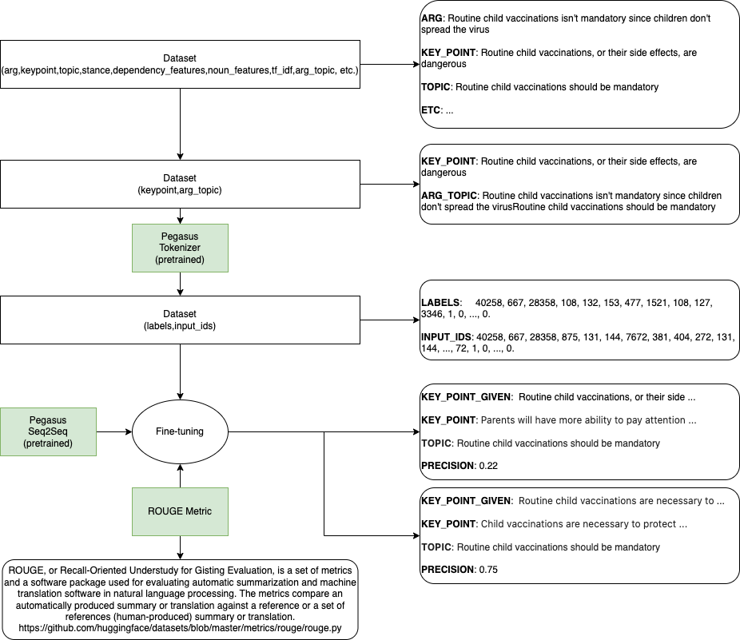

# Enigma KP Extraction

Paper:

https://arxiv.org/abs/2110.12370

Code: 

https://github.com/manavkapadnis/Enigma_ArgMining
https://github.com/IBM/KPA_2021_shared_task

# Main points:

1) Mainly focused on the first track (i.e. KP matching)

2) Uses lexical similarity + semantic features

3) Input to Dense layers: Transformer (BERT/RoBERTa/BART/DeBERTa) + Dependency parsing tree (spacy) / POS (spacy) / TF-IDF (turned out to be the best)

4) No generation description in the article

# Generation overlook
